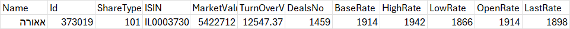
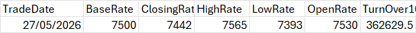

  
# The testing_data directory:  
  
The directory contains all the data relevant for testing the project.
All data is collected into paths, which will be the file
name while using S3.
  
  
There are 3 directories
  
## daily_data:
Contains files with the name: **dd-mm-yyyyy.csv**

Each file contains a csv relevant for the date, which has
saved data about the trade rates. the data is such:  

## historic_data:
Contains files with the name: **x data.csv**

Each file is representing a stock, and should have some historic
data that is relevant. Data should start from the earliest date
possible, and will be updated according to daily and sync files

## Sync_data:
Contains two types of files:

**AllDaily-time** - files which contain all the daily
data in one. The idea is to create according to the need
such a file and to be able to merge it into historical data
when needed. 

The format is:
the same as the daily_data, with an extra field, 'Date'

**sync_file** - 
A single file which contain all the daily
data in one. Yet those files are managed automatically and 
will provide more data to more time back. Basically a version for daily_data
which will mainly use for backup.

format is the same as AllDaily-time

